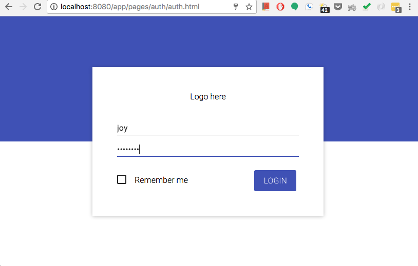
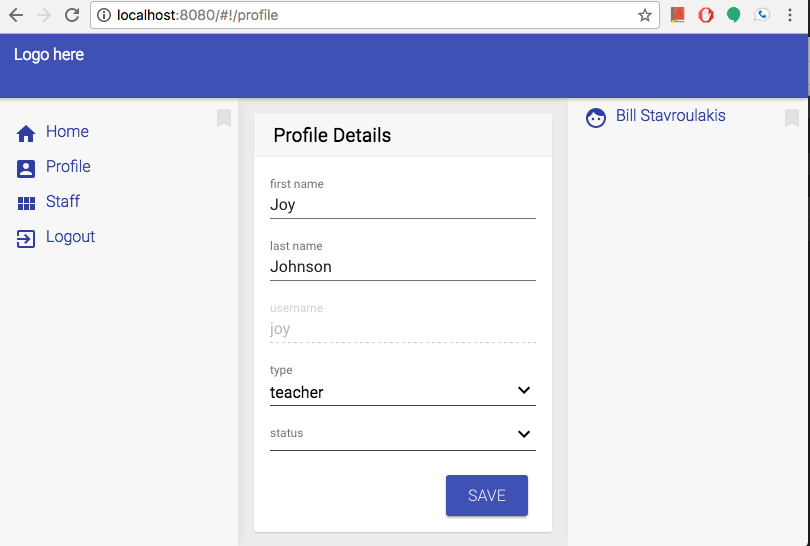
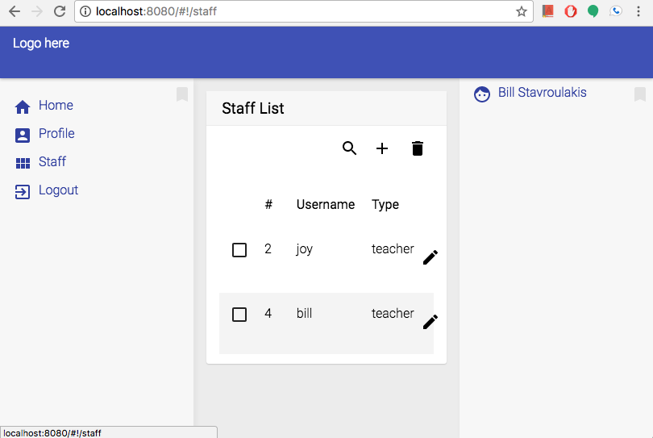
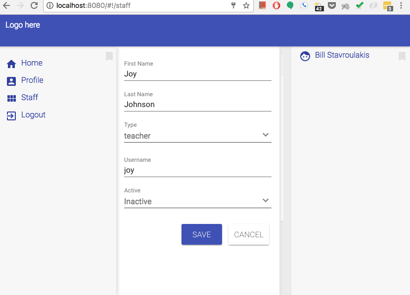
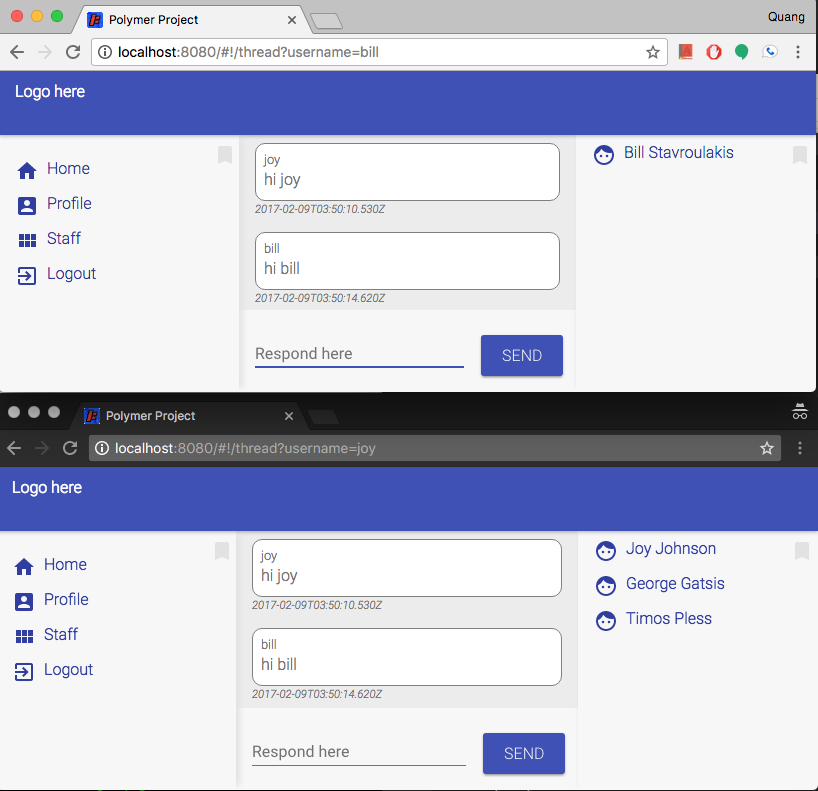

Polymer Project
========

### Web Dashboard built in Polymer and Material Design to administer education staff and allow web chat using socket.io.

# Getting Started ###
* `npm install`
* `bower install`
* `npm install -g gulp`
* `gulp sass` (only if .css files do not exists)

# Run
* `node /demo-server/app.js`

# URL
* http://localhost:8080/ Web App
* http://localhost:5000/ Json Server
* http://localhost:8080/tests/ Testing Components

# Screenshot

